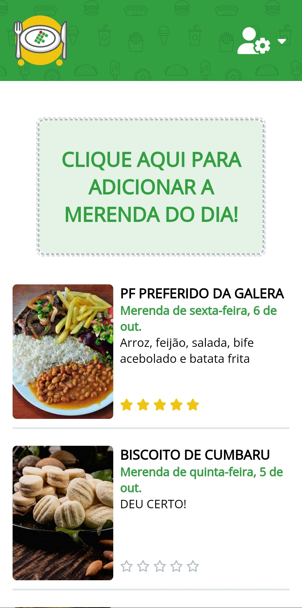
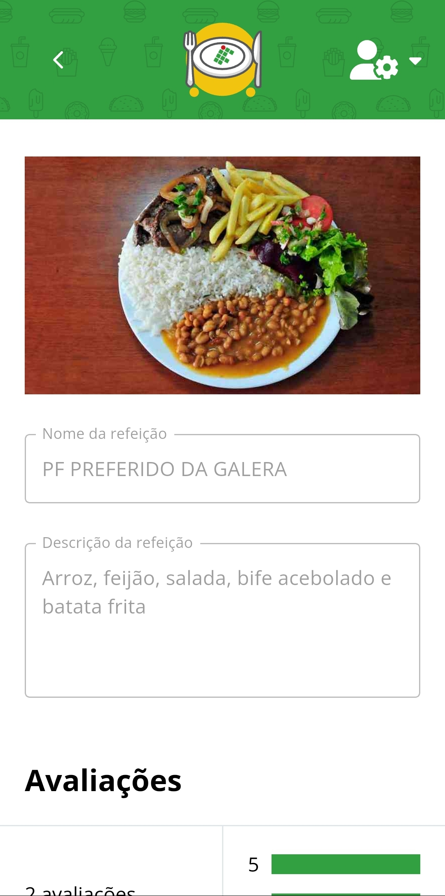
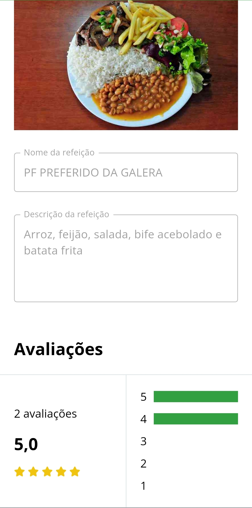
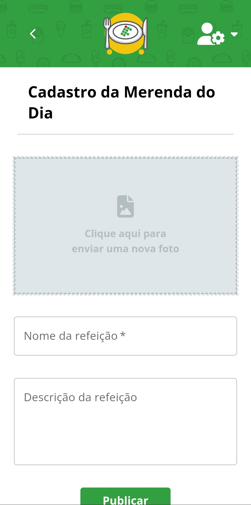
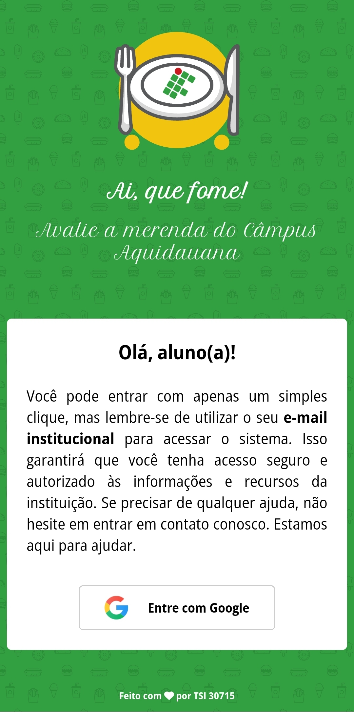
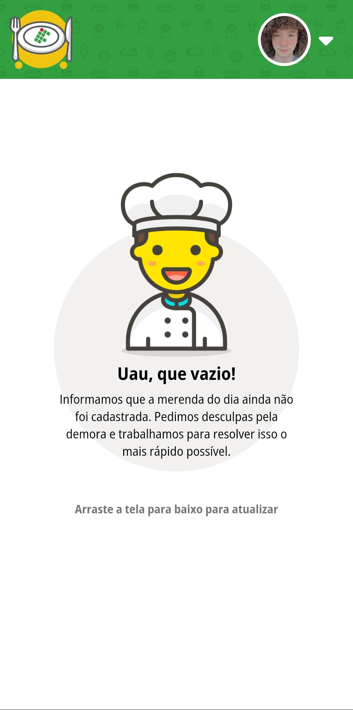

# ai-que-fome-showcase

## Sumário

- [ai-que-fome-showcase](#ai-que-fome-showcase)
  - [Sumário](#sumário)
  - [Motivação](#motivação)
  - [Pilha de tecnologia](#pilha-de-tecnologia)
    - [API](#api)
    - [Módulos administrativo e discente](#módulos-administrativo-e-discente)
  - [Galeria](#galeria)
    - [Módulo administrativo](#módulo-administrativo)
    - [Módulo discente](#módulo-discente)

## Motivação

<!-- Motivação -->

Os repositórios de código apresentados no Curso Superior de TSI do IFMS como requisito para obtenção da nota parcial das atividades da unidade curricular Linguagem de Programação IV estão privados. Entretanto, este é o _terceiro_ repositório de código público da unidade curricular cujo intuito é manter a lista de repositórios de código ordenada.

| [&larr; Repositório anterior](https://github.com/mdccg/i15d-fotorama) | [Próximo repositório &rarr;](#) |
|-|-|

## Pilha de tecnologia

Os créditos pelas mídias utilizadas estão disponíveis nos repositórios privados do projeto. 

### API

| Artefato | Tecnologia |
|-|-|

<!-- Listar -->

### Módulos administrativo e discente

| Artefato | Tecnologia |
|-|-|
| Biblioteca de desenvolvimento | React |
| Bundler | create-react-app |
| Biblioteca de interface de usuário | Material Design |

<!-- Listar e linkar -->

## Galeria

### Módulo administrativo

### Módulo discente

